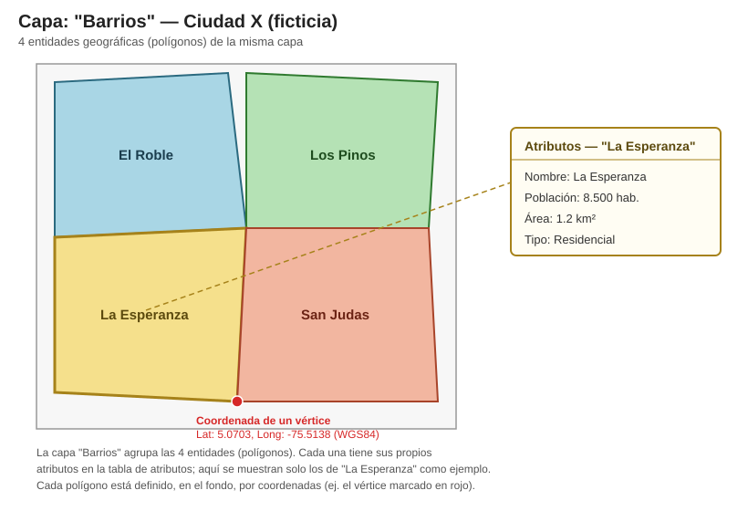
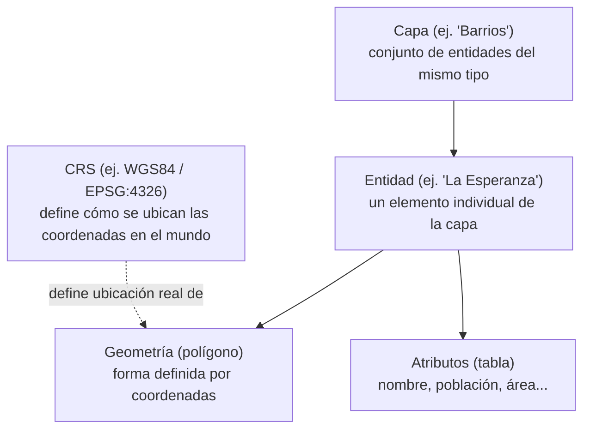

# Glosario — Proyecto 1: Fundamentos GIS

## Dato espacial vs no espacial
Un **dato espacial** es aquel que tiene una ubicación asociada en el mundo real, representada mediante coordenadas (ej. la ubicación de un hospital, el trazado de una calle, el polígono de un barrio). Un **dato no espacial** es un valor o atributo que no tiene esa ubicación por sí solo — es solo información descriptiva (ej. el nombre del hospital, su número de camas). En un GIS, los datos no espaciales normalmente están asociados a un dato espacial (una geometría) a través de la tabla de atributos.

## Capa
Una **capa (layer)** es un conjunto de entidades geográficas del mismo tipo, que se carga, visualiza y gestiona como una sola unidad dentro de un software GIS (ej. QGIS). Por ejemplo, "Barrios de la ciudad" es una capa donde cada entidad es un polígono que representa un barrio. Un proyecto GIS normalmente combina varias capas (barrios, calles, hospitales) para analizarlas juntas.

## Atributo
Un **atributo** es la información no geométrica asociada a una entidad de una capa. Se guarda en la tabla de atributos, donde cada fila es una entidad y cada columna es un atributo (ej. para la capa "Barrios": nombre del barrio, población, área en km²). Los atributos permiten hacer preguntas sobre los datos sin depender únicamente de la forma o ubicación (ej. "¿qué barrios tienen más de 10.000 habitantes?").

## Coordenadas
Las **coordenadas** son los valores numéricos que ubican un punto en el espacio. En geografía se suelen expresar como (latitud, longitud) — un sistema angular basado en la posición sobre la esfera terrestre — o como (x, y) en sistemas proyectados (metros, por ejemplo). Toda geometría en un GIS (punto, línea o polígono) está definida, en el fondo, por una o varias coordenadas.

## Mapa ficticio de ejemplo (Ciudad X)
Para ilustrar gráficamente los términos anteriores: una capa "Barrios", con sus entidades geográficas en polígonos, los atributos de una entidad puntual y una coordenada de ejemplo.

## CRS (Coordinate Reference System)
Un **CRS** es el sistema que define cómo un conjunto de coordenadas se relaciona con ubicaciones reales sobre la superficie de la Tierra. Sin un CRS, un par de números (x, y) no significa nada — el CRS es el que le da contexto geográfico a esos números (qué forma de la Tierra se asume, qué unidad se usa, dónde está el origen). Dos capas con el mismo dato pero distinto CRS no se van a alinear correctamente en un mapa hasta que se reproyecten a un CRS en común.

**Algunos CRS comunes (nombre + EPSG):**
- **WGS84** (World Geodetic System 1984, EPSG:4326) — geográfico global, el que usa el GPS.
- **Web Mercator** (EPSG:3857) — proyectado, usado por Google Maps, OpenStreetMap y la mayoría de mapas web (tiles).
- **MAGNA-SIRGAS / Origen Nacional** (EPSG:3116) — proyectado, el oficial para cartografía en Colombia.
- **SIRGAS 2000** (EPSG:4674) — geográfico, datum oficial usado en gran parte de Sudamérica.
- **NAD83** (North American Datum 1983, EPSG:4269) — geográfico, usado en Estados Unidos y Canadá.
- **ETRS89** (European Terrestrial Reference System 1989, EPSG:4258) — geográfico, estándar en Europa.
- **UTM Zone 18N** (EPSG:32618) — proyectado, parte del sistema UTM (hay una zona EPSG distinta cada 6° de longitud); cubre buena parte de Colombia y la región andina.
- **British National Grid** (EPSG:27700) — proyectado, oficial para cartografía del Reino Unido.
- **GDA2020** (Geocentric Datum of Australia 2020, EPSG:7844) — geográfico, datum oficial de Australia.

## EPSG
**EPSG** es un catálogo estándar de códigos numéricos que identifican de forma única cada CRS (ej. EPSG:4326, EPSG:3116). En vez de describir manualmente todos los parámetros de un sistema de coordenadas, basta con referenciar su código EPSG para que cualquier software GIS sepa exactamente de qué sistema se trata.

## WGS84
**WGS84** (World Geodetic System 1984, EPSG:4326) es el sistema de referencia geográfico más usado a nivel mundial. Es el sistema que usa el GPS, y por eso es el estándar por defecto cuando se trabaja con coordenadas de latitud/longitud sin especificar otra cosa.

## Geometría: punto, línea y polígono
Toda entidad geográfica en un GIS se representa con uno de estos tres tipos de geometría (vector):
- **Punto:** una ubicación única (x, y). Ej. un hospital, un poste de luz, una cámara.
- **Línea:** una secuencia de puntos conectados que forman un trazado. Ej. una calle, un río, una tubería.
- **Polígono:** una secuencia de puntos que se cierra formando un área. Ej. un barrio, un lote, un lago.

## Vector vs raster
- **Vector:** representa el mundo con geometrías discretas y bien definidas (puntos, líneas, polígonos), cada una con sus propios atributos. Es ideal para entidades con límites claros (calles, lotes, edificios).
- **Raster:** representa el mundo como una grilla continua de celdas (píxeles), cada una con un valor. Es ideal para fenómenos continuos que no tienen un límite natural (elevación, temperatura, imágenes satelitales).

La diferencia clave: en vector cada entidad es un objeto independiente con su fila en la tabla de atributos; en raster no hay "entidades", solo una matriz de valores.

## Diagrama: cómo se relacionan capa–atributo–geometría–CRS

En resumen: una **capa** agrupa **entidades** del mismo tipo; cada entidad tiene una **geometría** (su forma/ubicación, expresada en coordenadas) y unos **atributos** (su información descriptiva, en la tabla de atributos); y el **CRS** es lo que le da significado geográfico real a esas coordenadas de la geometría.

